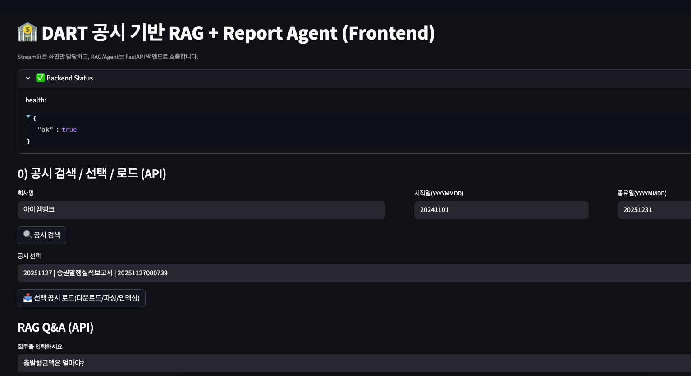
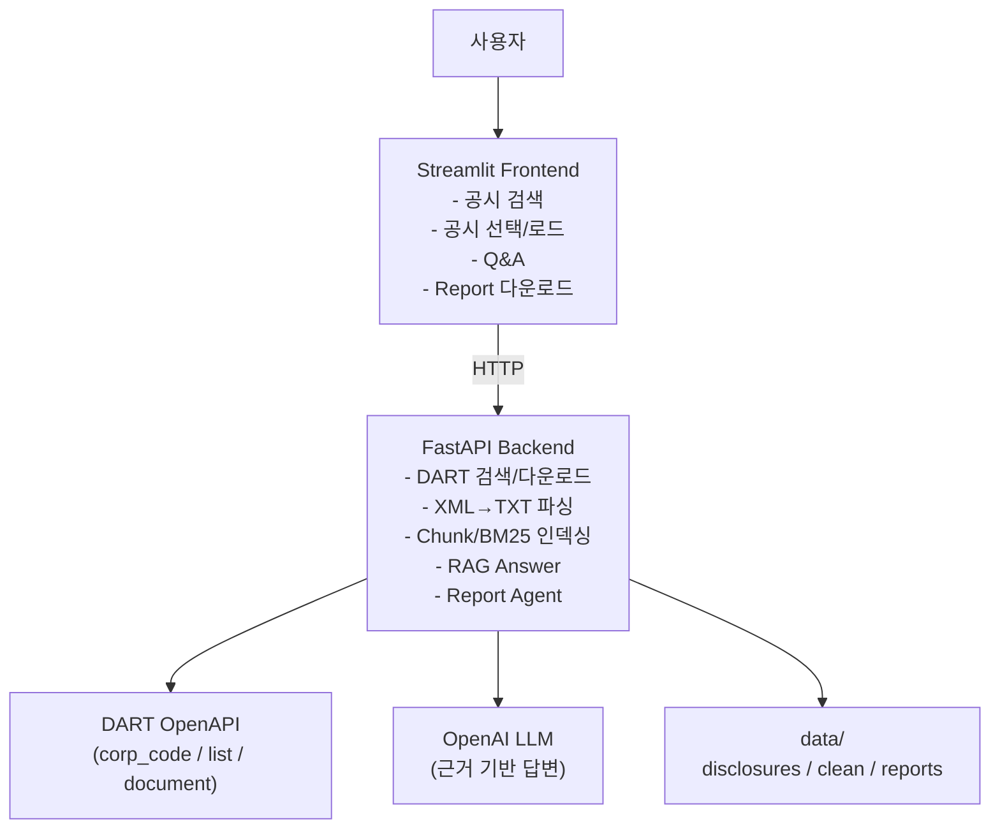
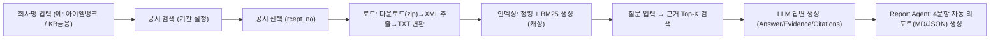

✅ [결과물 클릭](https://genaidartragagent-gtx8jmkptbizma9ypuq4dk.streamlit.app/)


# 🏦 DART 공시 기반 RAG + Report Agent

금융감독원 DART 공시(XML)를 **자동 수집 → 텍스트화 → 청킹/리트리벌 → 근거 기반 답변(RAG)** 까지 연결하고,  
버튼 한 번으로 **4개 핵심 질문 리포트(Markdown/JSON)** 를 생성하는 **금융 문서형 GenAI 포트폴리오**입니다.

- 프론트엔드: `Streamlit` (UI)
- 백엔드: `FastAPI` (DART 수집 + RAG + Report Agent)
- Retriever: `BM25`
- Generator: `OpenAI` (근거 기반 답변 + citations 포맷)
- Data: `DART 공시 (XML → TXT)`

✅ Render Backend URL: `https://genai-dart-rag-agent.onrender.com`  
✅ Streamlit Front URL: `https://genaidartragagent-gtx8jmkptbizma9ypuq4dk.streamlit.app/`

---

## 🧭 서비스 구조도 (Frontend ↔ Backend ↔ DART ↔ RAG ↔ Report)



---

## 🗺️ 프로젝트 동작 흐름


---

## ✅ 주요 기능
1) 공시 검색 (DART)
    - 회사명으로 corp_code 검색
    - 기간(start/end) 기준 공시 리스트 조회

2) 공시 로드 (다운로드/파싱/인덱싱)
    - 선택된 rcept_no 공시 ZIP 다운로드
    - XML 추출 후 TXT로 변환 저장
    - TXT를 청킹하고 BM25 인덱스 생성
    - “현재 선택된 공시” 기준으로 /ask, /report가 동작

3) RAG Q&A (근거 기반)
    - 질문 → Top-K 근거 검색 → 근거 기반 답변 생성
    - 출력 포맷: Answer / Evidence / Citations

4) Report Agent (자동 리포트)
    - “핵심 4문항”을 자동 실행하고 리포트 생성
    - 총발행금액, 상환기일, 신용평가등급(기관별), 인수기관
    - 결과를 data/reports/에 Markdown + JSON으로 저장
    - Streamlit에서 미리보기 + 다운로드 제공


---

## 📁 폴더 구조
```bash
GenAI_DART_RAG_Agent_iMbank/
├── app/
│   └── streamlit_app.py
├── backend/
│   └── main.py
├── scripts/
│   ├── dart_service.py
│   ├── _rag_answer_with_citations.py
│   └── _agent_generate_report.py
├── data/
│   ├── corp_codes/
│   ├── disclosures/
│   ├── clean/
│   └── reports/
└── requirements.txt (또는 backend/requirements.txt)
```

---

## 🚀 로컬 실행 방법

1. 백엔드 - FastAPI

```bash
# 루트에서
python -m venv .venv
source .venv/bin/activate

pip install -r requirements.txt   # 또는 backend/requirements.txt
uvicorn backend.main:app --reload --port 8000
```
FastAPI health: http://localhost:8000/health
FastAPI root: http://localhost:8000/ (배포 헬스체크용)


2. 프론트 - Streamlit

```bash
streamlit run app/streamlit_app.py
```
Streamlit: http://localhost:8501


---

## ☁️ 배포 ① Render (FastAPI 백엔드)

Render 설정
    - Service Type: Web Service
    - Start Command:

```bash
uvicorn backend.main:app --host 0.0.0.0 --port $PORT
```

Render 환경변수 (Environment)
Render → Service → Environment 탭에서 추가
    - OPENAI_API_KEY = (너 OpenAI 키)
    - DART_API_KEY = (너 DART 키) ← dart_service.py에서 쓰는 이름과 동일해야 함

✅ 배포 확인:
https://genai-dart-rag-agent.onrender.com/health
https://genai-dart-rag-agent.onrender.com/ (404 안 나와야 안정적)

---

## ☁️ 배포 ② Streamlit Community Cloud (프론트)
1) Main file path
    - app/streamlit_app.py

2) Secrets에 API_BASE 추가
    - Streamlit Cloud → App → Settings → Secrets 에 아래를 붙여넣기:
```toml
API_BASE="https://genai-dart-rag-agent.onrender.com"
```
3) 프론트 코드 (환경변수 대응)
    - Streamlit 코드에는 아래처럼 되어 있어야 합니다:
```python
import os
API_BASE = os.getenv("API_BASE", "http://127.0.0.1:8000")
```

---

## 🧯 개발 과정에서의 오류 & 해결

1) Render에서 / 접속 시 404 → 서버가 꺼짐/재시작
    - 원인: Render 헬스체크가 GET /를 때리는데 라우트가 없으면 404
    - 해결: backend/main.py에 @app.get("/") 추가

2) --port $PORT 에러
    - 원인: 로컬에서는 $PORT 환경변수가 비어있음
    - 해결:
        - 로컬: --port 8000
        - Render: --port $PORT

3) Streamlit에서 ModuleNotFoundError: scripts
    - 원인: “숫자로 시작하는 파일명 import” 또는 상대경로 문제
    - 해결:
        - scripts/05_...py 같은 파일은 import용으로 scripts/_rag_answer_with_citations.py처럼 이름 변경
        - Streamlit은 API만 호출하게 만들고, 로직은 FastAPI로 넘기기

4) OPENAI_API_KEY를 다시 확인

    - 원인: Render/Streamlit에 환경변수 키 이름이 다르거나, 다른 서비스에 넣음
    - 해결:
        - Render “백엔드 서비스” Environment에 OPENAI_API_KEY 정확히 추가
        - Streamlit은 API_BASE만 있으면 됨(키는 백엔드에만)

---

## ✅ 추 후 보강 아이디어
- “회사/기간 선택 → 여러 공시를 묶어서 요약 리포트 생성”
- “리스크 관점 질문 템플릿(신용등급/만기/발행조건 변화 등)”
- “Eval(정답 기반) + Guardrails(근거 없으면 거절)”
- “Agent: 공시 유형별 체크리스트 자동 생성 (채권/분기/사업보고서)”
